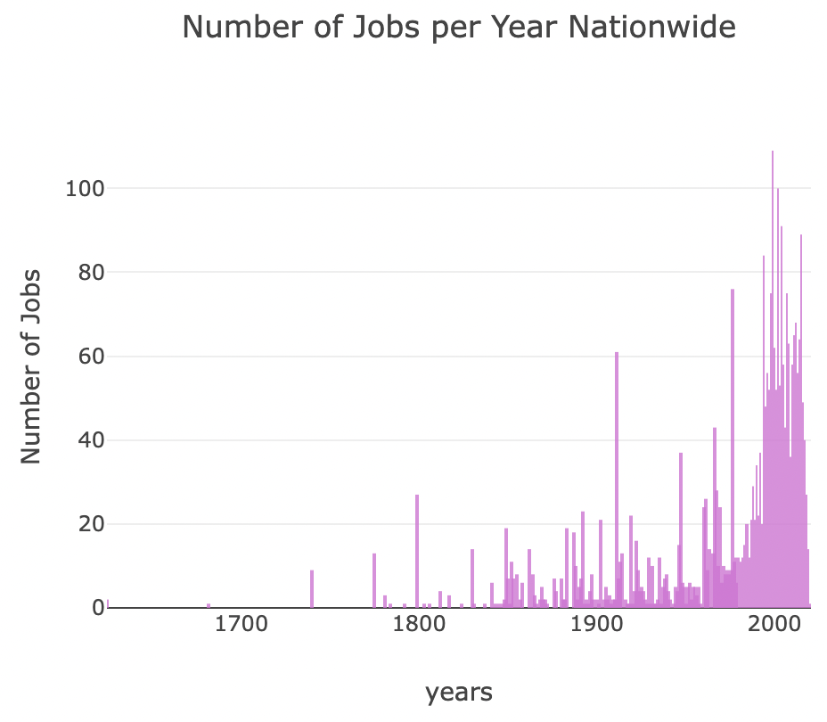
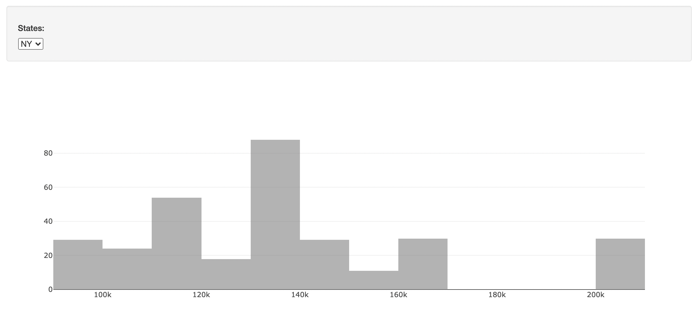

# Trends in Data Science

## Objective
In a data-centric world, the demand for talent in manipulating and analyzing data has grown exponentially.
In this project, we observe the trend of growing data related jobs in the U.S. to help aspiring data scientists answer the following questions:
    <ol>
        <li>How has the demand for data science talent trended over time?</li>
        <li>In what states do we find the most number of jobs related to data science?</li>
        <li>Which states have the highest average salary for a data scientist?</li>
    </ol>

### Datasets used:
1. 3,884 job listings related to data science, containing information on:
    <ul>    
        <li>Company Name</li>
        <li>Sector</li>
        <li>Average Salary</li>
        <li>Location</li>
    </ul>
2. Geo-coordinates of all 50 states
 <i>Source: <a href="https://data.world/">data.world</a></i>

### Data Transformation & PostgreSQL
While the dataset of 3,800+ data scientist job listings contained information on the location of the position in terms of city and state, we needed geo-coordinates of the states in order to plot out our observations through Plotly.
The two datasets were cleaned up to be consistent with one another before being merged into the 'data_clean.csv' file.
This finalized dataset was uploaded as a Heroku PostgreSQL database.

### Visualizations

Heatmap of average salary by state, the darker states representing states with higher average salaries compared to the lighter colored states.
 

Bar graph showing the number of jobs from 1600 to 2020, showing that data science jobs have been growing in number since the 1960s and have seen their most significant growths in 2020.
 

    
    Histogram showing the average salary distribution among the most prominent states in data science.

